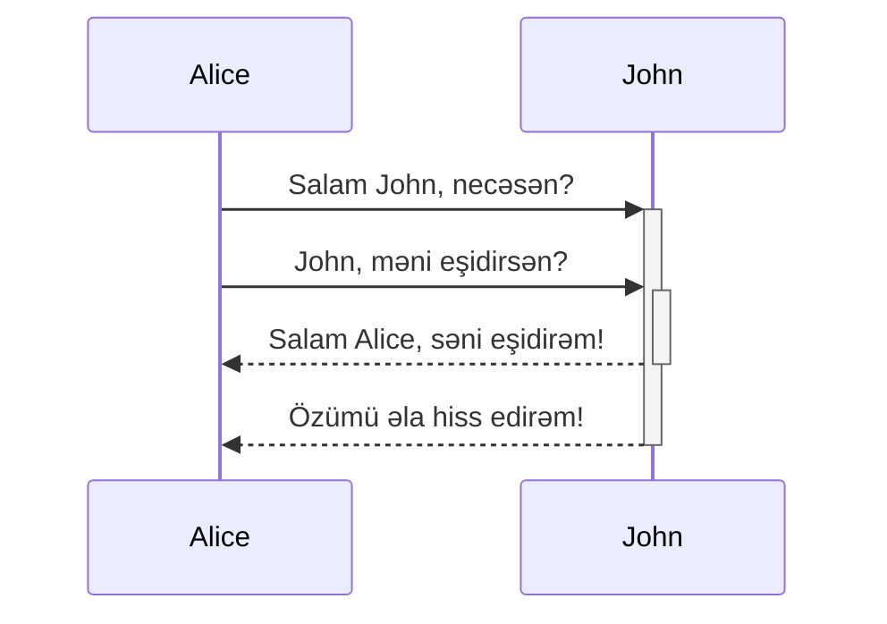
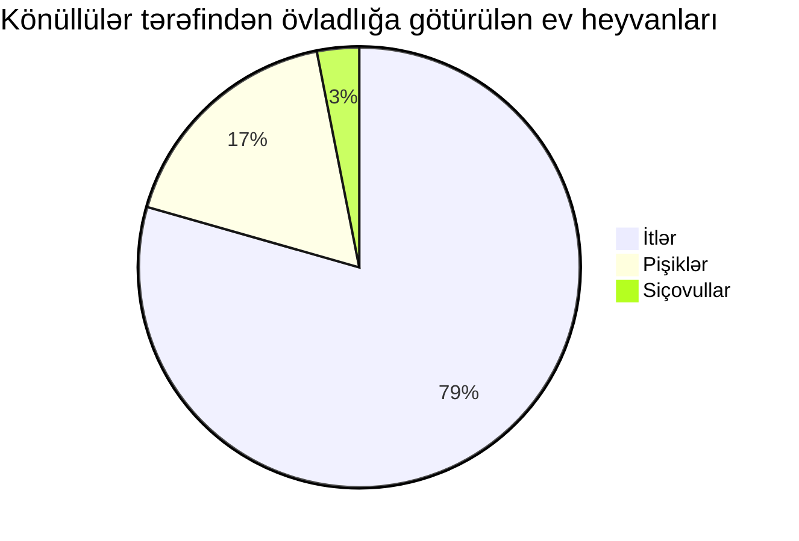

<docs-decorative-header title="Nümunələr toplusu (Kitchen sink)" imgSrc="adev/src/assets/images/components.svg"> <!-- markdownlint-disable-line -->
Bu, Angular.dev üçün bütün xüsusi komponentlərin və üslubların vizual siyahısıdır.
</docs-decorative-header>

Dizayn sistemi kimi, bu səhifə aşağıdakılar üçün vizual və Markdown müəlliflik təlimatlarını ehtiva edir:

- Xüsusi Angular sənədlər elementləri: [`docs-card`](#cards), [`docs-callout`](#callouts), [`docs-pill`](#pills), və [`docs-steps`](#workflow)
- Xüsusi mətn elementləri: [alertlər](#alerts)
- Kod nümunələri: [`docs-code`](#code)
- Daxili Markdown üslublu elementlər: linklər, siyahılar, [başlıqlar](#headers-h2), [üfüqi xətlər](#horizontal-line-divider)
- və daha çox!

Hazır olun:

1. Yazmaq...
2. möhtəşəm...
3. sənədlər!

## Başlıqlar (h2) {#headers-h2}

### Daha kiçik başlıqlar (h3)

#### Hətta daha kiçik (h4)

##### Daha da kiçik (h5)

###### Ən kiçik! (h6)

## Kartlar (Cards) {#cards}

<docs-card-container>
  <docs-card title="Angular nədir?" link="Platformaya Baxış" href="tutorials/first-app">
    Lorem ipsum dolor sit amet, consectetur adipiscing elit. Nullam ornare ligula nisi
  </docs-card>
  <docs-card title="İkinci Kart" link="İndi Yoxla" href="essentials/what-is-angular">
    Lorem ipsum dolor sit amet, consectetur adipiscing elit. Nullam ornare ligula nisi
  </docs-card>
    <docs-card title="Linksiz Kart">
    Lorem ipsum dolor sit amet, consectetur adipiscing elit. Nullam ornare ligula nisi
  </docs-card>
</docs-card-container>

### `<docs-card>` Atributları

| Atributlar              | Detallar                                           |
| :---------------------- | :------------------------------------------------- |
| `<docs-card-container>` | Bütün kartlar bir konteyner daxilində olmalıdır    |
| `title`                 | Kartın başlığı                                     |
| kartın məzmunu          | `<docs-card>` və `</docs-card>` arasındakı hər şey |
| `link`                  | (Könüllü) Hərəkətə Keçid (CTA) link mətni          |
| `href`                  | (Könüllü) Hərəkətə Keçid (CTA) linkinin ünvanı     |

## Qeydlər (Callouts) {#callouts}

<docs-callout title="Faydalı bir qeydin başlığı">
  Lorem ipsum dolor sit amet, consectetur adipiscing elit. Nulla luctus metus blandit semper faucibus. Sed blandit diam quis tellus maximus, ac scelerisque ex egestas. Ut euismod lobortis mauris pretium iaculis. Quisque ullamcorper, elit ut lacinia blandit, magna sem finibus urna, vel suscipit tortor dolor id risus.
</docs-callout>

<docs-callout critical title="Kritik bir qeydin başlığı">
  Lorem ipsum dolor sit amet, consectetur adipiscing elit. Nulla luctus metus blandit semper faucibus. Sed blandit diam quis tellus maximus, ac scelerisque ex egestas. Ut euismod lobortis mauris pretium iaculis. Quisque ullamcorper, elit ut lacinia blandit, magna sem finibus urna, vel suscipit tortor dolor id risus.
</docs-callout>

<docs-callout important title="Vacib bir qeydin başlığı">
  Lorem ipsum dolor sit amet, consectetur adipiscing elit. Nulla luctus metus blandit semper faucibus. Sed blandit diam quis tellus maximus, ac scelerisque ex egestas. Ut euismod lobortis mauris pretium iaculis. Quisque ullamcorper, elit ut lacinia blandit, magna sem finibus urna, vel suscipit tortor dolor id risus.
</docs-callout>

### `<docs-callout>` Atributları

| Atributlar                                       | Detallar                                                          |
| :----------------------------------------------- | :---------------------------------------------------------------- |
| `title`                                          | Qeydin başlığı                                                    |
| qeydin məzmunu                                   | `<docs-callout>` və `</docs-callout>` arasındakı hər şey          |
| `helpful` (default) \| `critical` \| `important` | (Könüllü) Ciddilik səviyyəsinə əsasən üslub və ikonlar əlavə edir |

## Pill-lər {#pills}

Pill sətirləri faydalı resurslara keçidləri olan bir növ naviqasiya kimi faydalıdır.

<docs-pill-row id=pill-row>
  <docs-pill href="#pill-row" title="Link"/>
  <docs-pill href="#pill-row" title="Link"/>
  <docs-pill href="#pill-row" title="Link"/>
  <docs-pill href="#pill-row" title="Link"/>
  <docs-pill href="#pill-row" title="Link"/>
  <docs-pill href="#pill-row" title="Link"/>
</docs-pill-row>

### `<docs-pill>` Atributları

| Atributlar       | Detallar                                   |
| :--------------- | :----------------------------------------- |
| `<docs-pill-row` | Bütün pill-lər bir pill sətrində olmalıdır |
| `title`          | Pill mətni                                 |
| `href`           | Pill href-i                                |

Pill-lər tək başına sətir içi də istifadə edilə bilər, lakin biz bunu hələ tam qurmamışıq.

## Alertlər (Xəbərdarlıqlar) {#alerts}

Alertlər xüsusi paraqraflardır. Onlar daha təcili olan bir şeyi vurğulamaq üçün faydalıdır. Onlar mətndən asılı olaraq şrift ölçüsü qazanır və bir çox səviyyədə mövcuddur. Alertlərdən çox məzmun göstərmək üçün deyil, ətrafdakı məzmuna diqqət çəkmək və onu təkmilləşdirmək üçün istifadə etməyə çalışın.

Alertləri Markdown-da yeni bir sətirdən başlayaraq `CİDDİLİK_SƏVİYYƏSİ` + `:` + `ALERT_MƏTNİ` formatında üslublandırın.

NOTE: Əsas mətn üçün _vacib_ olmayan köməkçi/əlavə məlumat üçün "Note"dan istifadə edin.

TIP: İstifadəçilərin yerinə yetirə biləcəyi konkret tapşırığı/hərəkəti və ya birbaşa tapşırığa/hərəkətə aid olan faktı vurğulamaq üçün "Tip"dən istifadə edin.

TODO: Tezliklə genişləndirməyi planlaşdırdığınız natamam sənədlər üçün "TODO"dan istifadə edin. TODO-nu kiməsə təyin də edə bilərsiniz, məsələn, TODO(emmatwersky): Mətn.

QUESTION: Oxucuya sual vermək üçün "Question"dan istifadə edin (cavab verə bilməli olduqları mini-viktoriya kimi).

SUMMARY: Səhifənin və ya bölmənin məzmununun iki və ya üç cümləlik xülasəsini təqdim etmək üçün "Summary"dən istifadə edin, beləliklə oxucular bunun onlar üçün doğru yer olub-olmadığını anlaya bilsinlər.

TLDR: Səhifə və ya bölmə haqqında vacib məlumatları bir-iki cümlə ilə təqdim edə bilirsinizsə, "TLDR"dən istifadə edin. Məsələn, TLDR: Rhubarb bir pişikdir.

CRITICAL: Potensial pis şeyləri vurğulamaq və ya oxucunu bir iş görməzdən əvvəl diqqətli olmağa çağırmaq üçün "Critical"dan istifadə edin. Məsələn, Warning: `rm` əmrini `-f` seçimi ilə işlətmək, yazılma qoruması olan faylları və ya qovluqları xəbərdarlıq etmədən siləcəkdir.

IMPORTANT: Mətni anlamaq və ya hər hansı bir tapşırığı yerinə yetirmək üçün həlledici olan məlumatlar üçün "Important"dan istifadə edin.

HELPFUL: Uğurlu olduğu bilinən və ya alternativlərdən daha yaxşı olan praktikaları vurğulamaq üçün "Best practice"dən istifadə edin.

NOTE: Diqqət `developers`! Alertlər [link](#alerts) və digər daxili üslublara malik **ola bilər** (lakin bundan **qənaətlə istifadə etməyə** çalışın!).

## Kod (Code) {#code}

Siz `code` elementini daxili üçlü dırnaq işarəsi (backtick) vasitəsilə göstərə bilərsiniz:

```ts
nümunə kod
```

Və ya `<docs-code>` elementindən istifadə edərək.

<docs-code header="İlk nümunəniz" language="ts" linenums>
import { Component } from '@angular/core';

@Component({
selector: 'example-code',
template: '<h1>Hello World!</h1>',
})
export class ComponentOverviewComponent {}
</docs-code>

### Nümunənin üslublandırılması

Budur tam üslublandırılmış bir kod nümunəsi:

<docs-code
  path="adev/src/content/examples/hello-world/src/app/app.component-old.ts"
  header="Üslublandırılmış kod nümunəsi"
  language='ts'
  linenums
  highlight="[[3,7], 9]"
  preview
  visibleLines="[3,10]">
</docs-code>

Terminal üçün də üslubumuz var, sadəcə dili `shell` olaraq təyin edin:

```shell
npm install @angular/material --save
```

Standart Markdown üçlü dırnaqlarını daha yaxşı təqdimat üçün atributlarla üslublandıra bilərsiniz:

```ts {header:"Möhtəşəm Başlıq", linenums, highlight="[2]", hideCopy}
console.log('Salam, Dünya!');
console.log('Möhtəşəm Angular Sənədləri!');
```

#### `<docs-code>` Atributları

| Atributlar     | Tip                  | Detallar                                                     |
| :------------- | :------------------- | :----------------------------------------------------------- |
| code           | `string`             | Taqlar arasındakı hər şey kod kimi qəbul edilir              |
| `path`         | `string`             | Kod nümunəsinin yolu (root: `content/examples/`)             |
| `header`       | `string`             | Nümunənin başlığı (default: `file-name`)                     |
| `language`     | `string`             | kodun dili                                                   |
| `linenums`     | `boolean`            | (False) sətir nömrələrini göstərir                           |
| `highlight`    | `string of number[]` | vurğulanmış sətirlər                                         |
| `diff`         | `string`             | dəyişdirilmiş kodun yolu                                     |
| `visibleLines` | `string of number[]` | yığılma (collapse) rejimi üçün sətirlər diapazonu            |
| `region`       | `string`             | yalnız təqdim olunan regionu göstər.                         |
| `preview`      | `boolean`            | (False) önizləməni (preview) göstər                          |
| `hideCode`     | `boolean`            | (False) Kod nümunəsinin standart olaraq yığılıb-yığılmaması. |

### Çoxfayllı nümunələr

Siz nümunələri `<docs-code-multifile>` daxilinə bükərək çoxfayllı nümunələr yarada bilərsiniz.

<docs-code-multifile
  path="adev/src/content/examples/hello-world/src/app/app.component.ts"
  preview>
<docs-code
    path="adev/src/content/examples/hello-world/src/app/app.component.html"
    highlight="[1]"
    linenums/>
<docs-code
    path="adev/src/content/examples/hello-world/src/app/app.component.css" />
</docs-code-multifile>

#### `<docs-code-multifile>` Atributları

| Atributlar | Tip       | Detallar                                                     |
| :--------- | :-------- | :----------------------------------------------------------- |
| məzmun     | `string`  | daxili `docs-code` nümunə tabları                            |
| `path`     | `string`  | Önizləmə və xarici link üçün kod nümunəsinin yolu            |
| `preview`  | `boolean` | (False) önizləməni göstər                                    |
| `hideCode` | `boolean` | (False) Kod nümunəsinin standart olaraq yığılıb-yığılmaması. |

### Kod nümunənizə `preview` əlavə edilməsi

`preview` bayrağının əlavə edilməsi, kod fraqmentinin altında kodun işlək nümunəsini qurur. Bu həmçinin işlək nümunəni Stackblitz-də açmaq üçün avtomatik olaraq düymə əlavə edir.

NOTE: `preview` yalnız standalone ilə işləyir.

### Nümunə önizləmələrinin Tailwind CSS ilə üslublandırılması

Tailwind utility klassları kod nümunələri daxilində istifadə edilə bilər.

<docs-code-multifile
  path="adev/src/content/examples/hello-world/src/app/tailwind-app.component.ts"
  preview>
<docs-code path="adev/src/content/examples/hello-world/src/app/tailwind-app.component.html" />
<docs-code path="adev/src/content/examples/hello-world/src/app/tailwind-app.component.ts" />
</docs-code-multifile>

## Tablar

<docs-tab-group>
  <docs-tab label="Kod Nümunəsi">
    <docs-code-multifile
      path="adev/src/content/examples/hello-world/src/app/tailwind-app.component.ts"
      hideCode="true"
      preview>
    <docs-code path="adev/src/content/examples/hello-world/src/app/tailwind-app.component.html" />
    <docs-code path="adev/src/content/examples/hello-world/src/app/tailwind-app.component.ts" />
    </docs-code-multifile>
  </docs-tab>
  <docs-tab label="Bəzi Mətn">
    Lorem ipsum dolor sit amet, consectetur adipiscing elit. Nulla luctus metus blandit semper faucibus. Sed blandit diam quis tellus maximus, ac scelerisque ex egestas. Ut euismod lobortis mauris pretium iaculis. Quisque ullamcorper, elit ut lacinia blandit, magna sem finibus urna, vel suscipit tortor dolor id risus.
  </docs-tab>
</docs-tab-group>

## İş axını (Workflow) {#workflow}

Nömrələnmiş addımları `<docs-step>` istifadə edərərək üslublandırın. Nömrələmə CSS vasitəsilə yaradılır (olduqca rahatdır!).

### `<docs-workflow>` və `<docs-step>` Atributları

| Atributlar        | Detallar                                           |
| :---------------- | :------------------------------------------------- |
| `<docs-workflow>` | Bütün addımlar bir iş axını daxilində olmalıdır    |
| `title`           | Addımın başlığı                                    |
| addımın məzmunu   | `<docs-step>` və `</docs-step>` arasındakı hər şey |

Addımlar yeni bir sətirdən başlamalıdır və `docs-code`lar və digər daxili elementlər və üslublar daxil edə bilər.

<docs-workflow>

<docs-step title="Angular CLI-ni quraşdırın">
  Siz layihələr yaratmaq, tətbiq və kitabxana kodu hazırlamaq və test, paketləşdirmə və yerləşdirmə kimi müxtəlif davamlı inkişaf tapşırıqlarını yerinə yetirmək üçün Angular CLI-dan istifadə edirsiniz.

Angular CLI-ni quraşdırmaq üçün terminal pəncərəsini açın və aşağıdakı əmri işlədin:

```shell
npm install -g @angular/cli
```

</docs-step>

<docs-step title="İş sahəsi və ilkin tətbiqi yaradın">
  Siz tətbiqləri Angular iş sahəsi daxilində inkişaf etdirirsiniz.

Yeni iş sahəsi və ilkin başlanğıc tətbiqini yaratmaq üçün:

- CLI `ng new` əmrini işlədin və burada göstərildiyi kimi `my-app` adını təqdim edin:

  ```shell
  ng new my-app
  ```

- `ng new` əmri sizdən ilkin tətbiqə daxil ediləcək xüsusiyyətlər haqqında məlumat istəyəcək. Enter və ya Return düyməsini sıxaraq standartları qəbul edin.

  Angular CLI lazımi Angular npm paketlərini və digər aslılıqları quraşdırır. Bu bir neçə dəqiqə çəkə bilər.

  CLI yeni bir iş sahəsi və işləməyə hazır olan sadə "Xoş Gəldiniz" tətbiqi yaradır.
  </docs-step>

<docs-step title="Tətbiqi işlədin">
  Angular CLI tətbiqinizi lokal olaraq qurmaq və xidmət etmək üçün server daxil edir.

1. İş sahəsi qovluğuna keçin, məsələn `my-app`.
2. Aşağıdakı əmri işlədin:

   ```shell
   cd my-app
   ng serve --open
   ```

`ng serve` əmri serveri işə salır, fayllarınızı izləyir və həmin fayllarda dəyişiklik etdikdə tətbiqi yenidən qurur.

`--open` (və ya sadəcə `-o`) seçimi brauzerinizi avtomatik olaraq <http://localhost:4200/> ünvanında açır.
Quraşdırma və nizamlamanız uğurlu olubsa, aşağıdakına bənzər bir səhifə görməlisiniz.
</docs-step>

<docs-step title="Son addım">
  Bütün sənəd komponentləri budur! İndi:

  <docs-pill-row>
    <docs-pill href="#pill-row" title="Gedin"/>
    <docs-pill href="#pill-row" title="möhtəşəm"/>
    <docs-pill href="#pill-row" title="sənədlər"/>
    <docs-pill href="#pill-row" title="yazın!"/>
  </docs-pill-row>
</docs-step>

</docs-workflow>

## Şəkillər və videolar

Siz semantik Markdown şəkli istifadə edərək şəkillər əlavə edə bilərsiniz:


### Şəkil ölçüsünü dəyişmək üçün `#small` və `#medium` əlavə edin


## Fiqurlu mötərizə sintaksisindən istifadə edərək atributlar əlavə edin


Yerləşdirilmiş videolar `docs-video` ilə yaradılır və sadəcə `src` və `alt` tələb edir:

<docs-video src="https://www.youtube.com/embed/O47uUnJjbJc" alt=""/>

## Diaqramlar və Qrafiklər

Kod dilini `mermaid` olaraq təyin etməklə [Mermaid](http://mermaid.js.org/) vasitəsilə diaqramlar və qrafiklər yazın, bütün mövzular (theming) daxil edilmişdir.






## Üfüqi Xətt Ayırıcısı {#horizontal-line-divider}

Bu, aşağıda edəcəyimiz kimi, səhifə bölmələrini ayırmaq üçün istifadə edilə bilər. Bu üslublar standart olaraq əlavə olunacaq, heç bir xüsusi şeyə ehtiyac yoxdur.

<hr/>

Son!

## Üstünlük verilir / Çəkinin (Prefer / Avoid)

```ts {prefer}
const foo = 'bar';
```

```ts {avoid}
const bar = 'foo';
```

```ts {avoid, header: 'başlıq ilə'}
const baz = 42;
```

<docs-code
  path="adev/src/content/examples/hello-world/src/app/app.component-old.ts"
  header="Üslublandırılmış kod nümunəsi"
  language='ts'
  linenums
  highlight="[[3,7], 9]"
  prefer>
</docs-code>
